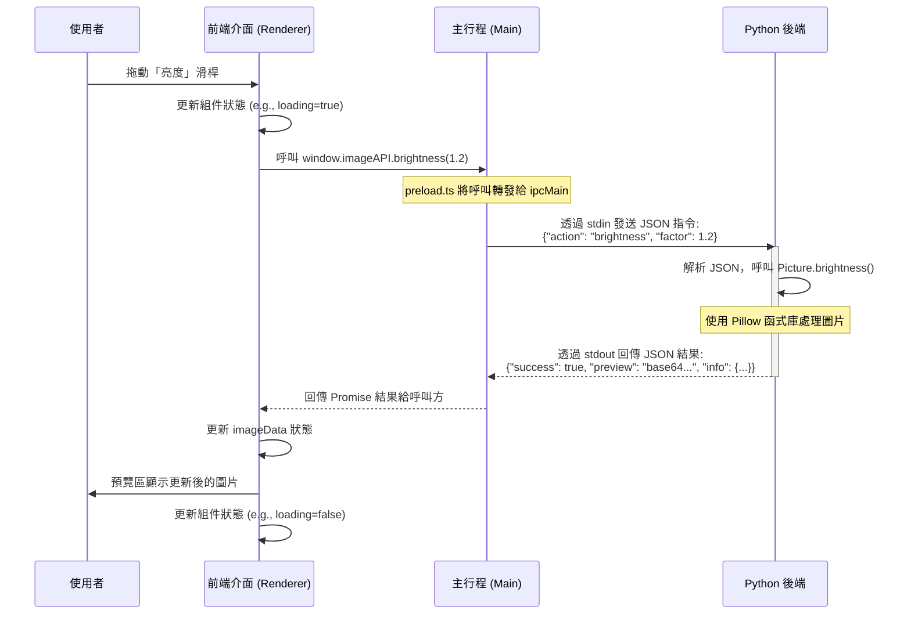

# 專案分析報告：Electron-Python 圖片處理工具

## 9.2.1 應用情境說明

### 目標使用者
本應用的目標使用者為需要對單張圖片進行快速、輕量級編修的族群，例如：
*   **社群媒體使用者**：在發布前快速調整圖片的亮度、對比度或套用濾鏡。
*   **內容創作者/部落客**：為文章或貼文統一處理圖片風格，如旋轉、裁切、增加暈影等。
*   **辦公室職員**：對文件中的圖片進行簡單的尺寸調整或灰階處理。
*   **程式開發者/設計師**：作為一個可擴充的圖片處理工具原型，進行功能驗證與擴充。

### 操作流程
一個典型的使用者操作流程如下：
1.  **啟動應用**：使用者執行應用程式，主介面隨即開啟。
2.  **載入圖片**：使用者可以透過點擊「選擇檔案」按鈕，或直接將圖片檔案拖曳到應用程式視窗中來載入一張圖片。
3.  **圖片預覽**：載入成功後，圖片的預覽圖會顯示在主畫面的預覽區。
4.  **功能操作**：
    *   使用者在左側的控制面板中選擇功能分頁（變換、顏色、效果）。
    *   透過滑桿、按鈕或輸入框調整參數（例如，拖動「亮度」滑桿）。
    *   每次操作後，後端 Python 會即時處理圖片，並將更新後的預覽圖回傳至前端顯示。
5.  **復原操作**：如果對結果不滿意，使用者可以點擊「復原」按鈕，將圖片恢復到最初載入的狀態。
6.  **儲存圖片**：當編輯完成後，使用者點擊「儲存檔案」按鈕，系統會彈出儲存對話框，讓使用者選擇儲存位置和檔案名稱。

### 預期功能
本應用程式提供了一系列核心的圖片處理功能，分為三大類：
1.  **檔案操作**：
    *   開啟本地圖片檔案。
    *   將編輯後的圖片儲存為新檔案。
    *   一鍵復原所有變更。
    *   清除目前載入的圖片。
2.  **圖片變換 (Transform)**：
    *   **旋轉**：以任意角度旋轉圖片。
    *   **翻轉**：水平或垂直翻轉。
    *   **調整尺寸**：自訂圖片的寬度和高度，可選擇是否保持長寬比。
    *   **裁切**：從圖片中心裁切指定大小的區域。
3.  **顏色調整 (Color)**：
    *   調整**亮度**、**對比度**、**飽和度**。
    *   調整**色相**、**色溫**。
    *   套用**灰階**、**負片**、**懷舊 (Sepia)** 效果。
    *   執行**自動對比度**或**直方圖等化**以改善影像。
4.  **濾鏡與效果 (Effects)**：
    *   **模糊**：高斯模糊或方框模糊。
    *   **銳化**：增強圖片細節。
    *   **邊緣偵測**、**浮雕**效果。
    *   **馬賽克 (Pixelate)**、**暈影 (Vignette)** 效果。
    *   套用**藝術效果**（如海報、素描）。
    *   為圖片**添加邊框**。

## 9.2.2 變數說明

### 前端 (TypeScript - `ImageEditor.tsx`)
| 變數名稱 | 型態 | 意義 |
| :--- | :--- | :--- |
| `imageData` | `string | null` | 當前顯示圖片的 Base64 編碼字串。 |
| `imageInfo` | `ImageInfo | null` | 當前圖片的資訊，包含寬、高、模式等。 |
| `loading` | `boolean` | 一個布林值，表示後端是否正在處理圖片。 |
| `activeTab` | `'transform' | 'color' | 'effects'` | 當前在左側面板中選中的功能分頁。 |

### 後端 (Python - `ipc_server.py`)
| 變數名稱 | 型態 | 意義 |
| :--- | :--- | :--- |
| `current_image` | `Optional[Image.Image]` | 當前正在被編輯的 PIL Image 物件。 |
| `original_image`| `Optional[Image.Image]` | 首次載入時的原始圖片備份，用於復原操作。 |
| `request` | `dict` | 從前端接收到的 JSON 指令，包含 `action` 和參數。 |
| `response` | `dict` | 準備回傳給前端的 JSON 結果，包含 `success` 狀態和資料。 |

## 9.2.3 程式流程圖

此處使用 Mermaid 序列圖來展示使用者「調整亮度」時，前後端的互動流程。



## 9.2.4 函式說明

### 後端主要函式 (`ipc_server.py` & `Picture.py`)

| 函式名稱 | 傳入值 | 回傳值 | 意義 |
| :--- | :--- | :--- | :--- |
| `handle_request` | `request: dict` | `dict` | 解析來自前端的 JSON 指令，分派到對應的圖片處理函式，並打包回傳結果。 |
| `_image_to_base64`| `img: Image.Image` | `str` | 將 PIL Image 物件轉換為 Base64 字串，以便透過 JSON 傳輸。 |
| `_create_preview` | `img: Image.Image` | `Image.Image` | 為過大的圖片建立一個縮小的預覽圖，以減少傳輸延遲。 |
| `Picture.brightness`| `factor: float` | `Image.Image` | 調整圖片亮度。`factor` > 1 變亮，< 1 變暗。 |
| `Picture.rotate` | `angle: float` | `Image.Image` | 將圖片旋轉指定的角度。 |
| `Picture.blur` | `radius: float` | `Image.Image` | 對圖片進行高斯模糊處理。 |

### 前端-主行程橋接函式 (`preload.ts`)

| 函式名稱 | 傳入值 | 回傳值 | 意義 |
| :--- | :--- | :--- | :--- |
| `imageAPI.loadFile` | `filePath: string` | `Promise<any>` | 請求後端從指定路徑載入圖片。 |
| `imageAPI.saveFile` | `outputPath: string` | `Promise<any>` | 請求後端將當前圖片儲存到指定路徑。 |
| `imageAPI.reset` | (無) | `Promise<any>` | 請求後端將圖片恢復到原始狀態。 |
| `imageAPI.brightness`| `factor: number` | `Promise<any>` | 請求後端調整圖片亮度。 |
| `imageAPI.rotate` | `angle: number` | `Promise<any>` | 請求後端旋轉圖片。 |

## 9.2.5 程式碼

以下是展示專案核心邏輯的關鍵程式碼片段。

#### 1. Python 後端伺服器 (`backend/ipc_server.py`)
這段程式碼展示了後端如何接收和處理一個名為 `brightness` 的指令。

```python
# ... (部分省略)
class IPCServer:
    # ... (部分省略)
    def handle_request(self, request: dict) -> dict:
        """處理前端請求"""
        action = request.get("action")

        try:
            # ... (其他 action)

            # 8. 亮度
            elif action == "brightness":
                factor = request.get("factor", 1.0)

                if self.current_image is None:
                    return {"success": False, "error": "尚未載入圖片"}

                # 呼叫 Picture 模組進行處理
                self.current_image = self.picture.brightness(factor)
                self.picture.set_image(self.current_image)

                # 回傳成功訊息和更新後的預覽圖
                return {
                    "success": True,
                    "message": f"亮度調整完成 (factor={factor})",
                    "info": self._get_image_info(self.current_image),
                    "preview": self._image_to_base64(self._create_preview(self.current_image))
                }
            
            # ... (其他 action)
        except Exception as e:
            return {"success": False, "error": str(e)}

    def run(self):
        """主迴圈 - 透過 stdin/stdout 進行 IPC 通訊"""
        while True:
            line = sys.stdin.readline()
            if not line:
                break
            request = json.loads(line)
            response = self.handle_request(request)
            json_str = json.dumps(response, ensure_ascii=False)
            sys.stdout.write(json_str + "\n")
            sys.stdout.flush()
```

#### 2. Electron 主行程 (`frontend/electron/main.ts`)
這段程式碼展示了主行程如何啟動 Python 子行程，並定義一個 IPC Handler 來轉發請求。

```typescript
// ... (部分省略)
let pythonProcess: ChildProcess | null = null;

function startPythonBackend() {
    const backendDir = isDev ? path.join(__dirname, '..', '..', 'backend') : /* ... */;
    const backendPath = path.join(backendDir, 'ipc_server.py');
    const pythonPath = findPython(backendDir);

    // 啟動 Python 子行程
    pythonProcess = spawn(pythonPath, [backendPath], {
        stdio: ['pipe', 'pipe', 'pipe'], // 使用 pipe 進行通訊
    });
    // ... (設定監聽)
}

// ... (部分省略)

// 處理來自前端的亮度調整請求
ipcMain.handle('image:brightness', async (event, { factor }) => {
    try {
        // 將請求轉發給 Python 後端
        return await sendToPython({ action: 'brightness', factor });
    } catch (error: any) {
        return { success: false, error: error.message };
    }
});

// ... (部分省略)
```

#### 3. 前端 UI 元件 (`frontend/src/components/ImageEditor.tsx`)
這段程式碼展示了 React 元件如何呼叫 `preload.ts` 中暴露的 API 來觸發後端功能。

```typescript
// ... (部分省略)
export default function ImageEditor() {
  // ... (狀態定義)

  // 處理圖片的通用函式
  const processImage = async (action: () => Promise<any>) => {
    setLoading(true);
    try {
      const result = await action(); // 執行傳入的 API 呼叫
      if (result.success && result.preview) {
        setImageData(result.preview); // 更新畫面
        setImageInfo(result.info);
      } else {
        alert('處理失敗: ' + (result.error || '未知錯誤'));
      }
    } finally {
      setLoading(false);
    }
  };

  return (
    // ... (JSX 結構)
    <ColorAdjustPanel
        // 將 API 呼叫包裝後傳遞給子元件
        onBrightness={(factor) => processImage(() => window.imageAPI.brightness(factor))}
        // ... (其他屬性)
    />
    // ... (JSX 結構)
  );
}
```

## 9.2.6 執行結果截圖並以文字說明截圖內容

由於我無法直接執行圖形化介面應用程式，因此無法提供真實的執行截圖。但我可以根據程式碼結構描述預期的畫面內容。

**【圖片描述】**

應用程式的主介面會是一個深色主題的視窗。整個介面分為左右兩部分：

*   **左側：控制面板 (寬度約 30%)**
    *   最上方是標題「圖片處理工具」。
    *   其下是「檔案操作」區塊，包含「選擇檔案」、「儲存檔案」、「復原」、「清除」等按鈕。
    *   中間是功能分頁標籤，有「變換」、「顏色」、「效果」三個選項，用於切換下方的控制項。
    *   下方是具體的控制項區域。例如，在「顏色」分頁下，會有多個滑桿，分別標示著「亮度」、「對比度」、「飽和度」等，旁邊可能還有重設按鈕。

*   **右側：預覽區 (寬度約 70%)**
    *   如果尚未載入圖片，此區域會顯示一個提示框，引導使用者「點擊此處選擇檔案或拖曳圖片至此」。
    *   載入圖片後，圖片會顯示在此區域的中央。
    *   當左側面板的操作導致後端處理時，圖片上方可能會覆蓋一個半透明的讀取中動畫 (Spinner)，表示正在處理中。
    *   圖片下方可能會顯示當前圖片的資訊，如「尺寸: 1024x768」、「模式: RGB」。

整體風格現代、簡潔，專注於功能操作與即時預覽。

## 9.2.7 與小畫家功能的比較

| 功能 | 本專案 (Electron-Python Image Editor) | 微軟小畫家 (MS Paint) | 比較分析 |
| :--- | :--- | :--- | :--- |
| **核心架構** | **跨平台 (Electron)**，核心運算由 **Python** 執行 | **原生 Windows 應用程式** | 本專案具備跨平台潛力，且將 UI 與運算分離，易於擴充複雜的演算法（如機器學習濾鏡）。小畫家則為輕量級原生應用，啟動快。 |
| **繪圖工具** | **無** (沒有畫筆、橡皮擦、填色等) | **非常豐富** (畫筆、噴槍、形狀、文字工具等) | 小畫家的核心是「繪圖」，而本專案的核心是「影像處理與濾鏡」。兩者定位不同。 |
| **顏色調整** | **專業且豐富** (亮度、對比度、飽和度、色溫、色相等) | **非常有限** (通常只有反轉色彩或基本的顏色選擇) | 本專案在此方面遠勝小畫家，提供了類似於初階相片編輯軟體的功能。 |
| **濾鏡與效果** | **豐富** (模糊、銳化、浮雕、暈影、藝術效果等) | **基本沒有** | 這是本專案最大的優勢。Python強大的生態系（Pillow, OpenCV）讓添加新濾鏡變得相對容易。 |
| **圖層概念** | **無** | **無** | 兩者都屬於破壞性編輯，不支援圖層。 |
| **操作體驗** | **即時預覽**，參數可透過滑桿微調 | 操作通常是**一次性**的，微調不便 | 本專案的互動方式更現代，使用者可以即時看到參數變化的效果，體驗更佳。 |
| **擴充性** | **高**。可輕易在 Python 端增加新功能，前端只需增加對應介面 | **低**。功能由微軟決定，使用者無法擴充。 | 本專案的架構使其非常適合二次開發和功能客製化。 |

**總結**：本專案並非小畫家的替代品，而是一個專注於 **「照片後製與濾鏡套用」** 的工具。它犧牲了小畫家的自由繪圖功能，換來了更專業、更強大的影像調整與效果處理能力，並且擁有更好的擴充性和跨平台潛力。
